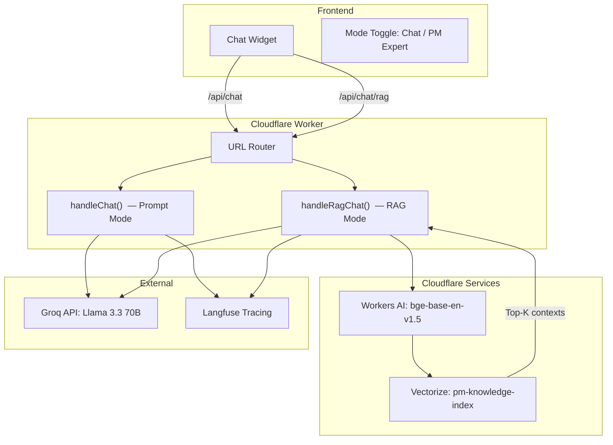

# Dual-Mode AI Chatbot: Prompt-Based + RAG Pipeline

Add a second chatbot mode powered by Cloudflare Vectorize RAG, togglable from the chat UI. The prompt-based chatbot remains untouched; the RAG chatbot retrieves context from `knowledge.json` embeddings and answers **only** from PM interview experience.

## User Review Required

> [!IMPORTANT]
> **Cloudflare Account Setup Required**  
> Before deploying, you'll need to run one CLI command to create the Vectorize index on your Cloudflare account:
> ```bash
> npx wrangler vectorize create pm-knowledge-index --preset "@cf/baai/bge-base-en-v1.5"
> ```
> This uses the `bge-base-en-v1.5` preset (768 dimensions, cosine metric) which matches the Workers AI embedding model.

> [!IMPORTANT]
> **Workers AI Binding**  
> The RAG mode uses Cloudflare Workers AI (free tier) for generating embeddings at query time. This requires an `ai` binding in `wrangler.jsonc`. No API keys needed — it's a native Cloudflare binding.

> [!WARNING]
> **Dual Endpoint Architecture**  
> The existing `/api/chat` prompt endpoint is untouched. A new `/api/chat/rag` endpoint handles RAG requests. The frontend sends requests to different endpoints based on the toggle state. This keeps the two modes completely independent.

## Proposed Changes

### Backend — Cloudflare Worker

#### [MODIFY] [index.js](file:///Users/ronak/Coding/Hugo_2/ai-chat-proxy/src/index.js)

Restructure the Worker source to support both modes. Key changes:

1. **Add RAG route handler (`/rag`)**: New `handleRagChat()` function that:
   - Receives user message + history + sessionId (same shape as prompt mode)
   - Generates query embedding using Workers AI (`@cf/baai/bge-base-en-v1.5`)
   - Queries Vectorize index for top-5 most similar PM knowledge atoms
   - Filters by similarity threshold (>0.5) to avoid noise
   - Builds a **strict RAG system prompt** that instructs the LLM to answer ONLY from retrieved context (no general knowledge)
   - Calls Groq LLM with the retrieved context + user query
   - Returns response with `{ reply, traceId, metadata: { mode: "rag", retrievedAtoms, ... } }`

2. **Full Langfuse tracing for RAG mode** — parity with prompt mode:
   - `trace-create` event with RAG-specific metadata (mode, retrieved chunk count, embedding latency, vector search latency)
   - `span-create` for embedding generation
   - `span-create` for vector search
   - `generation-create` for LLM call
   - All metadata tagged with `mode: "rag"` and `promptVersion: "v1-rag"` so you can compare in Langfuse dashboards

3. **RAG System Prompt** — Designed to produce **starkly different** answers:
   - Strict instruction: "Answer ONLY using the PM experience context provided below. If the context doesn't cover the question, say so honestly."
   - No personality/flair — factual, interview-style, citing specific atoms
   - Each retrieved atom shown with title + content for grounding
   - No fallback to general knowledge (unlike prompt mode which has full KB baked in)

4. **Routing update**: Add URL matching for `/rag` path to route to the new handler

#### [MODIFY] [wrangler.jsonc](file:///Users/ronak/Coding/Hugo_2/ai-chat-proxy/wrangler.jsonc)

Add Vectorize and Workers AI bindings:

```jsonc
{
  // ... existing config ...
  "vectorize": [
    {
      "binding": "VECTORIZE",
      "index_name": "pm-knowledge-index"
    }
  ],
  "ai": {
    "binding": "AI"
  }
}
```

#### [NEW] [seed-vectors.js](file:///Users/ronak/Coding/Hugo_2/ai-chat-proxy/scripts/seed-vectors.js)

A one-time script (run via `wrangler dev --remote` or deployed Worker) to:
1. Read all 25 atoms from `knowledge.json`
2. For each atom, create a text representation: `"{title}: {summary}. {content}"`
3. Generate embeddings using Workers AI (`@cf/baai/bge-base-en-v1.5`)
4. Upsert vectors into Vectorize with metadata: `{ id, title, tags, use_cases }`
5. Exposed as a `/admin/seed` endpoint (protected by `ADMIN_KEY`)

---

### Frontend — AI Chat Widget

#### [MODIFY] [ai-chat-widget.js](file:///Users/ronak/Coding/Hugo_2/public/js/ai-chat-widget.js)

Add mode toggle UI and dual-endpoint logic:

1. **Toggle Switch in Header** — A sleek pill-shaped toggle between "Chat" and "PM Expert" modes:
   - **"Chat"** (default) = existing prompt-based chatbot (hits `/api/chat`)
   - **"PM Expert"** = RAG-based chatbot (hits `/api/chat/rag`)
   - Toggle sits in the header bar, styled with the gradient theme
   - Switching mode clears the conversation and shows mode-specific suggested questions

2. **Visual Mode Indicators** — to make the difference stark to users:
   - **Chat mode**: Current header subtitle "Trained on my product work and case studies"
   - **PM Expert mode**: Subtitle changes to "RAG-powered · Answers from real PM interview experience"
   - Bot messages in PM Expert mode get a subtle badge/icon indicator
   - Different suggested questions per mode:
      - Chat: Current questions (general portfolio)
      - PM Expert: "How did you handle a scaling challenge?", "Tell me about a stakeholder conflict you resolved", "Walk me through your underwriting workflow redesign"

3. **Request Routing** — `form.onsubmit` checks toggle state and hits the appropriate endpoint:
   - Chat mode → `POST /api/chat`
   - PM Expert mode → `POST /api/chat/rag`

4. **Response metadata display** — In PM Expert mode, optionally show which knowledge atoms were retrieved (light footer text under the bot message)

---

## Architecture Diagram



## Open Questions

> [!IMPORTANT]
> **Q1: Groq API Key** — The `worker.md` (deployed version) uses Groq, but `src/index.js` still references OpenAI. Should the RAG mode also use Groq + Llama 3.3 70B (matching the production prompt chatbot), or do you want a different model? I'm assuming Groq since that's your production setup.

> [!IMPORTANT]
> **Q2: CORS Origin** — The deployed worker restricts to `https://ronaksethiya.com`. For local dev, should I add `http://localhost:3000` as well, or do you handle that separately?

> [!IMPORTANT]
> **Q3: `src/index.js` vs `worker.md`** — The source file (`src/index.js`) is a much simpler version than what's in `worker.md` (which has Langfuse, rate limiting, intent detection, etc.). Which is your actual production code? Should I update `src/index.js` to match `worker.md` first, then add RAG on top? Or should I treat `worker.md` as the production reference and update `src/index.js` accordingly?

## Verification Plan

### Automated Tests
1. Deploy Worker with `--remote` flag to test Vectorize binding
2. Seed the knowledge base: `curl -X POST https://your-worker.dev/admin/seed?key=YOUR_ADMIN_KEY`
3. Test RAG endpoint: `curl -X POST https://your-worker.dev/rag -H "Content-Type: application/json" -d '{"message":"How did you handle a scaling challenge?"}'`
4. Verify Langfuse traces appear under both `ronak-chatbot-prompt` and `ronak-chatbot-rag` trace names
5. Compare answers: same question to both endpoints should produce starkly different responses

### Manual Verification
1. Open the chat widget on the local Next.js dev server
2. Toggle between Chat and PM Expert modes
3. Ask the same question in both modes and confirm:
   - Chat mode: warm, CV-based conversational response
   - PM Expert mode: precise, context-grounded response citing specific PM experiences
4. Verify the UI toggle animation, header subtitle changes, and suggested questions update
